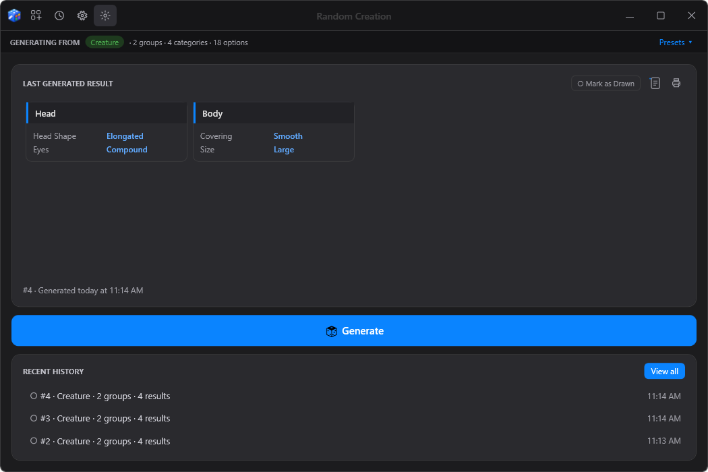
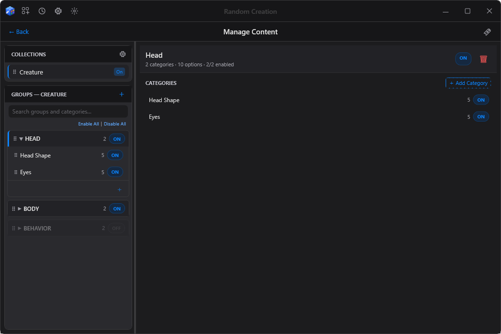
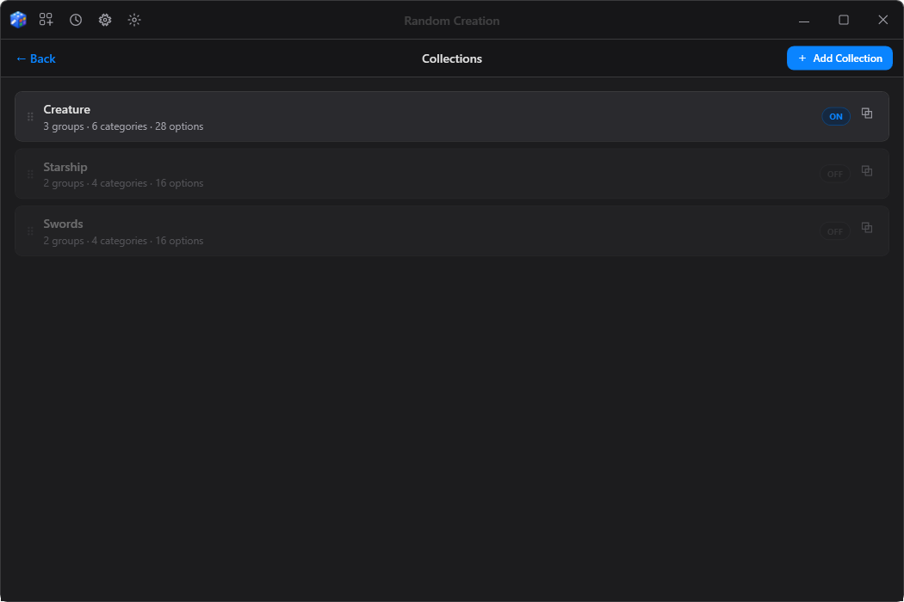
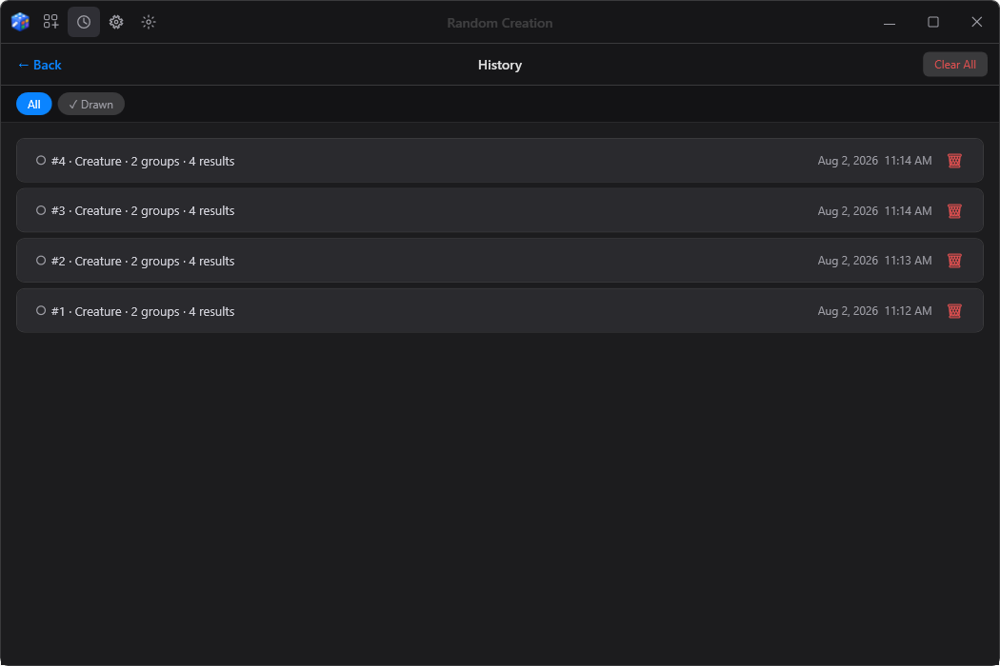
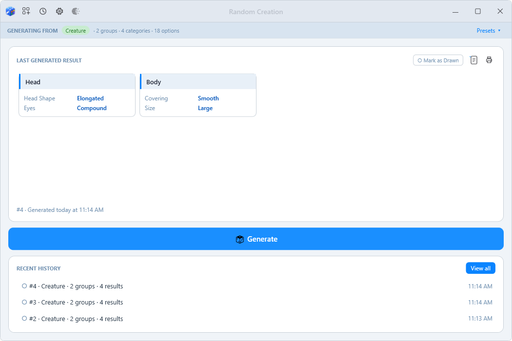

# Random Creation

**Random Creation builds random combinations out of content you define yourself.**

Describe the pieces of something — a creature, a starship, a gun, a character, a
planet — and let the app assemble them into combinations you didn't plan.

---

## How it works

You build a small hierarchy of your own content:

| Level | Example |
|-------|---------|
| **Collection** | Creatures |
| **Category Group** | Head |
| **Category** | Head Shape |
| **Option** | Round · Elongated · Flat · Skull-like · Beak-fronted |

Press **Generate** and the app picks one option from every enabled category, then
lays the result out as cards grouped by their group name.

Nothing in the app is specific to creatures. It has no built-in subject matter at
all — a collection is whatever you decide it is, so the same app works equally well
for monsters, spaceships, loot tables, NPCs, or anything else you can break into
parts.

---

## What it does

- **Collections, groups, categories and options** — organise content as deeply or as
  loosely as you like
- **Enable and disable anything** — at any level, so you can narrow a generation
  without deleting content
- **Weighted options** — make some results common and others rare
- **Presets** — save a whole enable/disable configuration and switch between setups
- **History** — every generation is kept, with a "drawn" marker for tracking what
  you've already used
- **Print preview** — get results onto paper
- **Dark, light and system themes**, plus three font sizes
- **Undo** for content edits, drag-and-drop reordering, and an internal
  cut/copy/paste clipboard

---

## Screenshots

| Managing content | Collections |
|---|---|
|  |  |

| History | Light theme |
|---|---|
|  |  |

---

## Getting it

**The easy way:** the **[product page](https://akcama.github.io/random-creation/)** has a
single Download button and plain-language instructions.

Or pick a file from the **[Releases](../../releases)** page. Every release comes in two forms:

- **Installer** (`RandomCreation-<version>-setup.exe`) — no admin rights needed; your
  content lives in your Windows user profile, safe across updates and uninstalls
- **Portable** (`RandomCreation-<version>-portable.zip`) — no installation; unzip it
  anywhere and run `RandomCreation.exe`; your content lives in a `data` folder beside the app

Either way it is **Windows only** and there is **nothing to install first** — everything the
app needs is bundled, including the .NET runtime.

> **A note on the Windows warning.** The download isn't code-signed, so Windows may
> show a blue *"Windows protected your PC"* screen. Click **More info**, then **Run
> anyway**. This is what Windows shows for any application from a developer who
> hasn't bought a signing certificate; it isn't a detection of anything.

---

## Your content

Everything you create lives in one folder — `data` beside the app for the portable
version, `%LocalAppData%\RandomCreation` for the installed one. **Settings → Open data
folder** opens it either way:

| File | Holds |
|------|-------|
| `categories.json` | All your collections, groups, categories and options |
| `history.json` | Your generation history |
| `presets.json` | Your saved presets |
| `settings.json` | Theme, font size, window position |

Copy that folder to another machine and your entire setup goes with it. Back it up
by copying it somewhere safe.

A new install starts with sample content so there is something to generate straight
away. The same sample ships in the `samples` folder beside the app to show what the
format looks like; the app only ever copies it in when you have no content at all, so
your own content is never overwritten.

---

## Status

Version 4.0. A personal creative tool in active use, not a commercial product.

---

## Licence

**This is not an open source project.** The source is published for reference only.
All rights reserved — see [LICENSE](LICENSE) for the full terms.

Bug reports and suggestions are welcome. Code contributions are not being accepted.

Copyright © 2026 Henry Robinson.
